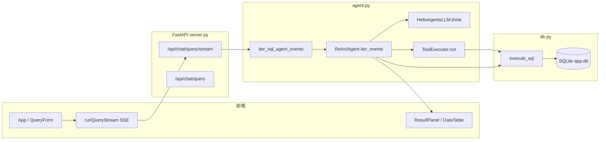

# User RAG — 自然语言查数（React + FastAPI + ReAct Agent）

业务数据落在 **MySQL** 当前库中的可查询业务表（默认主表名 **`users`**，可与实际库中表名一致）；查询意图经 **LLM + ReAct** 转成 **MySQL `SELECT`**，结果回前端。元数据与审计在同库 **`query_logs` 表**（启动时自动建表），经反馈回流到 **知识上下文**（轻量 RAG）。下面按 **数据从哪里来、经过谁、写回哪里** 把整条链路写清楚；**连接与配置**见第 3 节，**Agent / SQL / Finish 约束**见 **第 12 节**。

---

## 数据流程链路（核心）

### 链路速览

| 链路                             | 方向              | 输入数据                                                                                           | 输出 / 落库                                                        | 主要代码                                                                             |
| -------------------------------- | ----------------- | -------------------------------------------------------------------------------------------------- | ------------------------------------------------------------------ | ------------------------------------------------------------------------------------ |
| **A. 业务数据入站**        | 外 → 库          | `.xlsx` / `.csv` 等表格文件                                                                    | **指定表名**整表 `DROP` 后重建 + 全量插入                  | `db.import_xlsx_to_sqlite`，`POST /api/system/import`（`Form` 字段 `table`） |
| **B. 启动/bootstrap 补数** | 文件 → 库        | 默认 xlsx 路径                                                                                     | 无表或表头不一致时同 A                                             | `db.bootstrap_database`                                                            |
| **C. 知识上下文组装**      | 库 + 文件 → 文本 | 业务表 schema/行数、`query_logs` 正例、`knowledge_assets.json`、用户问题，以及语义工具中间结果 | 一段 Markdown 注入 LLM 提示                                        | `tools.build_knowledge_context`，`country_match`                                 |
| **D. ReAct 探查读**        | 库 → Agent       | 当前**查询范围**内的业务表（见 `context_tables`）                                          | 工具返回 JSON（样本/统计/关键词命中），进入 History                | `tools.ToolExecutor.run` → `db.*` / `tools.*`                                 |
| **E. 终局查询读**          | 库 → API         | `Finish` 里的 SQL 字符串                                                                         | `columns` + `rows` + 规范化后的 `sql`                        | `db.execute_sql` → `_guard_select_sql`                                          |
| **F. 查询日志写**          | API → 库         | 问题、理解、SQL、`tool_trace`                                                                    | `query_logs` 新行，`user_feedback` 初值为 NULL                 | `db.log_query`                                                                     |
| **G. 反馈闭环**            | 前端 → 库        | `log_id` + 是否有帮助                                                                            | 更新 `user_feedback`，影响 C 中正例是否出现                      | `db.set_query_feedback`                                                            |
| **H. 导出再读**            | 库 → 文件流      | 前端提交的 SQL                                                                                     | CSV/xlsx 字节（与 E 同一套守卫 SQL）                               | `db.export_sql_as_bytes`                                                           |
| **I. 流式展示**            | API → 前端       | SSE 事件序列                                                                                       | React state：`liveTraces` / `liveTranscript` / 最终 `result` | `runQueryStream`，`App.applyStreamEvent`                                         |

**分工**：**业务表**（如 `users` 及导入时指定的其它表）= 真相源，被 SELECT 与探查工具读取；**`query_logs`** = 问答与工具轨迹审计 + 经反馈筛选的「有帮助」SQL 示例源，**不参与**业务计算。

### 总体数据流（从文件到屏幕）

```mermaid
flowchart TB
  subgraph ingest [数据入站]
    XLSX[Excel 文件]
    IMP[import_xlsx_to_sqlite]
  end

  subgraph sqlite [(backend/data/app.db)]
    U[(业务表 users 等)]
    Q[(query_logs 日志表)]
  end

  subgraph know [知识组装 无写 users]
    KA[knowledge_assets.json]
    KC[tools.build_knowledge_context]
    CM[country_match 国家解析与 SQL 模板]
  end

  subgraph react [ReAct 循环]
    LLM[Ollama generate]
    TOOL[探查工具]
    FIN[Finish 解析出 SQL]
  end

  subgraph exec [执行与落日志]
    EX[execute_sql 只读业务表]
    LQ[log_query 写 query_logs]
  end

  subgraph fe [前端]
    UI[表格 / SQL 面板 / 轨迹]
  end

  XLSX --> IMP --> U
  KA --> KC
  U --> KC
  Q --> KC
  CM --> KC
  KC --> LLM
  LLM --> TOOL
  TOOL --> U
  LLM --> FIN
  FIN --> EX
  EX --> U
  EX --> LQ
  LQ --> Q
  EX --> UI
  Q -.->|user_feedback=1 的正例| KC
```

### A～B：业务数据如何进库

1. **手动导入**：`POST /api/system/import`，表单 **`file`** + **`table`**（目标表名，默认 `users`）。支持 **`.xlsx` / `.xlsm` / `.xltx` / `.xltm` 与 `.csv`**。**`import_xlsx_to_sqlite`**：`DROP` 目标表后按首行建列、插入全部行；表名须 **`^[A-Za-z_][A-Za-z0-9_]*$`**，且不得为 `query_logs`、`sqlite_*` 等保留名。若表头已有 `id` 列则不再自动加合成主键列。响应含 **`target_table`**、**`detected_columns`**、**`imported_rows`**。
2. **启动自动对齐**：`bootstrap_database` 仅针对默认 **`users`** 与 **`DEFAULT_XLSX_PATH`**：若 `users` 不存在、无行、或列名与模板表头不一致，则按上条逻辑 **重建 `users`**。其它业务表不参与启动自动对齐。
3. **删表**：`DELETE /api/system/tables/{table_name}` 删除可查询业务表（受 `validate_business_table_name` 与内部表保护）。

### C：知识上下文里流动什么（不修改业务表）

1. **来自 `users`**：`list_columns`、`count_users`、部分列的 `distinct_values` 样例 → 写入 Knowledge 的「相关列 / 高频值」。
2. **来自 `query_logs`**：`recent_query_examples` 只取 **`user_feedback = 1`** 且 SQL 中列名仍存在于当前 `users` 的记录 → 「相似成功查询」few-shot。
3. **来自文件**：`knowledge_assets.json` → 术语、规则、指标说明。
4. **来自问题**：`country_match.resolve_country_intent` 命中时追加 **Country resolution**（规范英文名 + 推荐 WHERE 模板）。
5. **输出**：`build_knowledge_context` 会先做规则检索，再串联 `infer_query_slots`、`profile_table_semantics`、`infer_filter_columns`、`Search_value_examples`、时间列分析等语义工具，把它们的结果汇总成 **单一字符串** → 进入 **`REACT_PROMPT_TEMPLATE` 的 `Knowledge:`**，与 **History** 一起每轮发给模型。

### D～E：一次提问时，数据怎样被读

1. **Bootstrap（仍算读库）**：`Get_table_schema` → 读 `users` 元数据（行数、列定义）→ 写入 `history_prefix`，并 `yield` SSE `bootstrap`。
2. **探查步**：模型选 `Inspect_rows` / `Profile_table_semantics` / `Infer_filter_columns` / `Search_keyword_across_columns` 等（见 **§4.1** 白名单）→ 底层为 **对可查询业务表的受控读操作**；其中语义工具现在统一走 **“启发式召回候选 + 轻量 LLM 语义重排/归纳”** 的混合模式，仍复用与主 Agent 同一套后端配置。**缺省表**由请求体 **`context_tables`** 决定（多选时第一张为主表，工具省略 `table` 时用主表），结果进入 History。
3. **Finish 步**：模型产出 **SQL 文本** → 列名校验、**国家/计数类守卫**、**`validate_where_predicate_column_fit`（WHERE 列语义）** 等（见 **§12**）→ **`_guard_select_sql`** → **`execute_sql`** → **`columns` + `rows`** → **`QueryResponse`**。

### F～G：日志与 RAG 闭环（写 query_logs、再喂回知识）

1. **成功或部分结束路径**会调用 **`log_query`**：把 **原始问题、understanding、最终 sql、tool_trace JSON** 插入 `query_logs`，得到 **`query_log_id`** 返回前端。
2. 用户点 **有帮助/无帮助** → **`set_query_feedback`** 更新 `user_feedback`（1 / -1）。
3. 之后任意新问题的 **`build_knowledge_context`** 再读 `query_logs` 时，**只有有帮助的记录**会作为示例进入提示词，形成 **「查询 → 日志 → 反馈 → 下次提示词」** 的闭环。当前仍然**不是向量库**，而是 **规则检索 + 语义工具 LLM 推理** 的轻量混合 RAG。

### H：导出链路（同一 SQL、第二次读）

前端把 **当前结果页上的 SQL 字符串** 发到 **`POST /api/chat/export`** → **`export_sql_as_bytes`** 内部 **再次 `execute_sql`**（与 E 相同守卫）→ 从 `users`（及 SQL 表达式）拉出全量结果 → 编码为 **CSV 或 xlsx 字节流** 下载。此处 **不写 `query_logs`**。

### I：前端数据形态（屏幕上的状态）

1. **流式**：`runQueryStream` 解析 SSE → `bootstrap` / `step` / `tool_result` 等事件 → 累积 **`liveTraces`、`liveTranscript`**（左侧工具与过程区）。
2. **`done`**：payload 为完整 **`QueryResponse`**（含 `rows`、`sql`、`agent_transcript`、`tool_trace`、`query_log_id`）→ **`setResult`**，清空 live 缓冲，右侧表格与 SQL、反馈按钮绑定 **`result`**。
3. **健康与导入**：`GET /health` 读 **行数**；导入成功后 **`row_count` 变化**，与 A 写入的 `users` 一致。

### 请求调用关系（与上图互补：谁调谁）



---

## 1. 服务启动与同步查询（补充）

1. **`uvicorn backend.main:app`**：`main.py` 导出 `server.app`；加载时 **`bootstrap_database()`**。
2. 前端 **`npm run dev`**：`main.tsx` 挂载 `App`，`fetchHealth` 拉状态。
3. **`POST /api/chat/query`**：走 **`run_sql_agent` → `ReActAgent.run`**，内部消费 **`iter_events`**，与流式 **同一套** ReAct + `execute_sql`，只是 HTTP 一次返回完整 JSON，无中间 SSE。

---

## 2. 目录结构

```text
.
├── backend/
│   ├── main.py              # ASGI 入口：导出 app
│   ├── server.py            # FastAPI 路由、CORS、生命周期
│   ├── agent.py             # LLM、ReAct 循环、解析 Finish
│   ├── tools.py             # Agent 工具层、知识上下文、语义工具、ToolExecutor
│   ├── db.py                # MySQL 访问、导入、安全 SELECT、query_logs
│   ├── country_match.py     # 国家意图解析 + 中英文 SQL 模板（注入 Knowledge）
│   ├── knowledge_assets.json # 术语 / 指标 / 规则（被 tools.py 读取）
│   ├── schemas.py           # Pydantic 请求/响应模型
│   └── data/                # app.db、导出文件等
├── frontend/
│   └── src/                 # React + Vite
├── requirements.txt
└── （可选）总用户数据下钻列表_20260318.xlsx  # 默认引导导入源
```

---

## 3. 环境与配置

| 变量                                             | 作用                                                                                                                                                                          |
| ------------------------------------------------ | ----------------------------------------------------------------------------------------------------------------------------------------------------------------------------- |
| `USER_RAG_LLM_BACKEND`                         | `ollama` / `local`：强制本机 Ollama；`openai` / `vllm` / `remote`：强制 OpenAI 兼容（须配 Base URL）；不设则 **auto**：有 OpenAI Base URL 用远程，否则 Ollama |
| `USER_RAG_OPENAI_BASE_URL`                     | OpenAI 兼容服务根地址，须含 `/v1`，如 `http://10.147.252.6:7777/v1`（也可用 `OPENAI_BASE_URL`）                                                                         |
| `USER_RAG_VLLM_HOST` + `USER_RAG_VLLM_PORT`  | 与上一项二选一，自动拼成 `http://{host}:{port}/v1`                                                                                                                          |
| `USER_RAG_OPENAI_MODEL` / `OPENAI_MODEL`     | 远程模型名，默认 `Qwen3-30B`                                                                                                                                                |
| `OPENAI_API_KEY` / `USER_RAG_OPENAI_API_KEY` | vLLM 可填任意非空，默认 `vllm-is-awesome`                                                                                                                                   |
| `USER_RAG_MYSQL_HOST` / `MYSQL_HOST`         | 默认 `127.0.0.1`                                                                                                                                                            |
| `USER_RAG_MYSQL_PORT` / `MYSQL_PORT`         | 默认 `3306`                                                                                                                                                                 |
| `USER_RAG_MYSQL_USER` / `MYSQL_USER`         | 默认 `root`                                                                                                                                                                 |
| `USER_RAG_MYSQL_PASSWORD` / `MYSQL_PASSWORD` | 密码（`-p` 对应此项）                                                                                                                                                       |
| `USER_RAG_MYSQL_DATABASE` / `MYSQL_DATABASE` | **必填**，业务表所在库名                                                                                                                                                |
| 项目根目录 `.env`                              | 若安装 `python-dotenv`（已在 `requirements.txt`），启动时会自动加载；可复制 **`.env.example`** 为 `.env` 填写 `MYSQL_DATABASE` 等                             |
| `OLLAMA_BASE_URL`                              | 默认 `http://127.0.0.1:11434`                                                                                                                                               |
| `OLLAMA_MODEL`                                 | 默认 `qwen2.5:3b`                                                                                                                                                           |
| `USER_RAG_AGENT_MAX_STEPS`                     | ReAct 最大步数，默认 `8`                                                                                                                                                    |
| `USER_RAG_USE_REWRITE`                         | 设为 `1`/`true` 等则启用问题重写                                                                                                                                          |
| `USER_RAG_FULL_KNOWLEDGE`                      | 设为 `1` 等则知识块更长（更多列/规则/示例）                                                                                                                                 |
| `USER_RAG_LLM_TEMPERATURE` 等                  | 传给 Ollama `generate` 的 `options`                                                                                                                                       |
| `USER_RAG_EXECUTE_MAX_ROWS`                    | `execute_sql` 默认最大返回行数（默认 `1000`）；全量意图下 ReAct 终局执行仍不截断                                                                                          |
| `USER_RAG_KEYWORD_MAX_COLUMNS`                 | `Search_keyword_across_columns` 单表最多扫描列数上限（默认约 `20`，见 `db.py` 钳制）                                                                                    |
| `USER_RAG_PROFILE_TABLE_MAX_COLUMNS`           | `Profile_table_columns` 大表画像时最多处理列数（默认约 `24`）                                                                                                             |

---

## 4. HTTP API 一览

| 方法   | 路径                                | 说明                                                                                                                                         |
| ------ | ----------------------------------- | -------------------------------------------------------------------------------------------------------------------------------------------- |
| GET    | `/api/system/health`              | 状态、**默认 `users` 行数**、工具列表、**Agent LLM**（`llm_backend` / `llm_model` / `llm_base_url` / `llm_config_ok`） |
| GET    | `/api/system/schema`              | 默认**`users`** 列定义                                                                                                                     |
| GET    | `/api/system/tables`              | 全部可查询业务表：`name`、`row_count`、`column_count`、`is_default_table`                                                            |
| DELETE | `/api/system/tables/{table_name}` | 删除指定业务表（保留名不可删）                                                                                                               |
| POST   | `/api/system/import`              | `multipart`：`file` + 表单 **`table`**（目标表名，默认 `users`）；支持 **xlsx/xlsm/csv** 等，整表重建                    |
| GET    | `/api/tools`                      | 全部已注册工具定义                                                                                                                           |
| POST   | `/api/tools/run`                  | 调试执行单个工具                                                                                                                             |
| POST   | `/api/chat/query`                 | Body：`question` + 可选 **`context_tables`**（多选查询范围；空则默认 `users` 若存在）。返回完整 `QueryResponse`                |
| POST   | `/api/chat/query/stream`          | 同上；SSE，事件见下文                                                                                                                        |
| POST   | `/api/chat/feedback`              | 提交 `query_log_id` 是否有帮助                                                                                                             |
| POST   | `/api/chat/export`                | 按 SQL 导出 csv/xlsx                                                                                                                         |

**SSE 事件类型（`iter_events`）**：`bootstrap`、`step`（Thought/Action）、`tool_start`、`tool_result`、`sql`、`sql_error`、`done`（含完整 `response` 字典）。

### 4.1 Agent 工具一览（`GET /api/tools` / `ToolExecutor`）

以下为 **当前 `backend/tools.py` 中 `ToolExecutor` 已注册**的工具名（与模型 ReAct 里 `Action: ToolName[{JSON}]` 一致）。**未写参数**表示无参或仅 `{}`。若后续有增删，以 **`GET /api/tools`** 或 [tools.py](/home/fenrir/Desktop/Sany/user_rag_humanized_tools/user_rag/backend/tools.py) 为准。

| 工具名                            | 作用                                                                                   | 主要参数                                                                    |
| --------------------------------- | -------------------------------------------------------------------------------------- | --------------------------------------------------------------------------- |
| `Get_database_tables`           | 列出可查询业务表（`row_count`、`column_count`、`is_default_table` 等）           | —                                                                          |
| `Get_table_schema`              | 表结构；列含 `is_text_like` / `is_numeric` / `is_time_like` / `enum_candidate` | `table_name`                                                              |
| `Get_table_relationships`       | `PRAGMA foreign_key_list` 汇总                                                       | —                                                                          |
| `Search_relevant_schema`        | 全库表/列相关度召回                                                                    | `question`、`max_tables`、`max_columns_per_table`                     |
| `Inspect_rows`                  | 统一表样本；默认每行字典，可选 `as_dict:false` 得行列数组                            | `table`、`limit`、`filters`、`as_dict`、`order_by`、`columns`   |
| `Profile_column`                | 单列画像 + top values + 样例                                                           | `column` 或 `field`、`table`、`top_k`、`keyword` 等               |
| `Profile_table_columns`         | 整表各列概况                                                                           | `sample_per_column`、`table`                                            |
| `Profile_table_semantics`       | 结合列名、类型与样例值推断列角色（time/country/platform/measure 等）                   | `table`、`query`、`sample_limit`、`distinct_limit`、`max_columns` |
| `Find_relevant_columns`         | 按问题与列名相关度排序（非值域搜索）                                                   | `query`、`table`、`top_k`                                             |
| `Infer_filter_columns`          | 推断“国家/平台/ID/时间”等过滤条件最可能落在哪些列                                    | `query`、`table`、`value`、`semantic_type`、`top_k`               |
| `Find_time_columns`             | 启发式疑似时间列                                                                       | `table`                                                                   |
| `Find_join_path`                | 两表间外键 BFS 路径                                                                    | `from_table`、`to_table`                                                |
| `Profile_time_column`           | 时间列样例与范围分析                                                                   | `table`、`column`                                                       |
| `Search_value_examples`         | 在候选列中搜索某个值的真实样例，常用于 grounding 过滤条件                              | `keyword`、`value`、`table`、`columns`、`semantic_type`           |
| `Search_keyword_across_columns` | 单表多列关键词命中统计                                                                 | `keyword`、`keywords`、`column_names`、`table`                      |
| `Search_keyword_in_tables`      | 跨表搜索关键词，定位值在哪张表、哪几列                                                 | `keyword`、`tables`、`limit_per_table`                                |
| `Search_similar_values`         | 与真实枚举值的相似度（拼写纠错）                                                       | `field`、`query`、`limit`、`table`                                  |
| `Infer_join_candidates`         | 无外键时推测可用 JOIN 键                                                               | `tables`、`limit`                                                       |
| `Validate_join_candidate`       | 用样本/重叠情况校验某组 JOIN 键是否靠谱                                                | `from_table`、`from_column`、`to_table`、`to_column`                |
| `Validate_sql`                  | 校验 +`warnings` + **`risk_level`**；**不执行**                        | `sql`                                                                     |
| `Explain_sql`                   | `EXPLAIN` 查询计划                                                                   | `sql`                                                                     |

**说明**：

- Agent 主循环现在只允许使用上述探查类工具加 `Finish`，不再在 ReAct 内直接暴露 `Execute_sql` / `Export` 之类终局工具。
- 其中 `Profile_table_semantics`、`Infer_filter_columns`、`infer_query_slots` 等是 `tools.py` 中的组合工具：它们会先调用 `db.py` 读 schema/样本做候选召回，再按需要调用轻量 LLM 做语义判断与重排。

### 4.2 当前工具调用整体流程（`backend/tools.py` + `backend/agent.py`）

一次查询里，工具调用的实际链路如下：

1. 前端把 `question` 和可选 `context_tables` 发到 `/api/chat/query` 或 `/api/chat/query/stream`。
2. `agent._resolve_context_tables(...)` 先确定本轮允许访问的表范围；如果前端没传，后端会先用 `search_relevant_schema(...)` 做一轮自动选表。
3. `tools.build_knowledge_context(...)` 先做规则检索（schema、行数、`knowledge_assets.json`、历史正反馈 SQL 示例），再串联 `infer_query_slots(...)`、`Profile_table_semantics(...)`、`Infer_filter_columns(...)`、`Search_value_examples(...)`、时间列分析，把结果拼成注入提示词的 Knowledge 文本。
4. `ReActAgent.iter_events(...)` 把 `question`、Knowledge、History、`ToolExecutor.tools_prompt_react()` 一起送给主 LLM，请它输出 `Thought:` 和 `Action:`。
5. 如果 `Action` 是工具调用，`agent._parse_action(...)` 先解析出 `ToolName[...]`；随后交给 `ToolExecutor.run(...)`。
6. `ToolExecutor._normalize_arguments(...)` 会统一参数别名、补默认值，并把 `table` / `table_name` 规范到当前 `context_tables` 范围内，避免模型乱传表名。
7. 真正执行时分两类：
   - 直连型工具：直接落到 `db.py`，例如 `Get_table_schema`、`Inspect_rows`、`Profile_column`、`Find_time_columns`、`Validate_sql`。
   - 组合型工具：先在 `tools.py` 内做启发式召回/归纳，再调用 `db.py`，并对关键候选使用轻量 LLM 做语义重排或角色判断，例如 `infer_query_slots`、`Profile_table_semantics`、`Infer_filter_columns`。`Search_value_examples` / `Search_keyword_*` 是否碰到 LLM 取决于是否需要借助 `profile_table_semantics` 自动选列。
8. 组合型工具如果启用了语义增强，会通过 `tools._call_semantic_llm_json(...)` 再调用一次轻量 LLM；它和主 Agent 共用同一套后端选择逻辑，优先走 `--vllm-url/--vllm-model` 对应的 OpenAI 兼容配置，没配时回退到本地 Ollama。`build_knowledge_context(...)` 也会消费这些组合工具的结果，所以首轮 Knowledge 已经不只是静态规则块。
9. 工具返回的 JSON 会被写入 `tool_trace`，同时压缩成 `Observation:` 追加回 History；流式接口还会立刻发一条 SSE `tool_result` 给前端。
10. 主 LLM 根据新的 History 继续下一轮 `Thought/Action`；如果信息已经足够，就输出 `Finish[UNDERSTANDING: ... SQL: SELECT ... SUMMARY: ...]`。
11. `agent.py` 在 Finish 路径里解析 SQL、做列名/动作白名单/只读 SQL 守卫，然后调用 `db.execute_sql(...)` 执行最终查询。
12. 成功后生成 `QueryResponse`，并通过 `db.log_query(...)` 把问题、SQL、`tool_trace` 写入 `query_logs`，供后续正反馈样例回流到 Knowledge。

可以把它理解成：

`前端请求 -> agent 选表 -> tools 拼知识 -> 主 LLM 选工具 -> ToolExecutor 归一化参数 -> db/tools 执行 -> Observation 回灌 -> 主 LLM Finish -> execute_sql -> log_query`

**提示词中的行为约束**（`REACT_PROMPT_TEMPLATE` 摘要）：必须用 **`Finish[UNDERSTANDING: / SQL: / SUMMARY:]`** 三标签交卷；国家类问题须按 Knowledge **Country resolution** 模板，且**列以 `Search_keyword_across_columns` 的命中为准**，**禁止**把国名条件写进 `注册时间` 等时间列；**`所属平台`** 仅表示 APP/PC 等渠道；涉国家草稿 SQL 建议先用 `Search_keyword_*` / `Search_value_examples` 定位值，再用 `Validate_sql` / `Explain_sql` 自检。

### 4.3 哪些地方用了 LLM，哪些没有

这里按 **直接调用 LLM** / **间接可能用到 LLM** / **完全不用 LLM** 三层来区分。

**直接调用 LLM**

- 主 Agent：
  - `HelloAgentsLLM.rewrite(...)`：问题改写。
  - `HelloAgentsLLM.think(...)`：ReAct 主循环每一轮 `Thought / Action` 生成。
- 语义工具：
  - `tools._call_semantic_llm_json(...)`：工具层统一轻量 LLM 入口。
  - `infer_query_slots(...)`：会调用 `_infer_query_slots_llm_cached(...)`，让 LLM 修正 `query_type / entity_hint / filters / derived_metric`。
  - `Profile_table_semantics(...)`：会调用 `_profile_table_semantics_llm_cached(...)`，让 LLM 判断列角色和相关性。
  - `Infer_filter_columns(...)`：会调用 `_infer_filter_columns_llm_cached(...)`，让 LLM 对候选过滤列做重排。

**间接可能用到 LLM**

- `build_knowledge_context(...)`：
  - 它自己不直接发 LLM 请求。
  - 但它会调用 `infer_query_slots(...)`、`Profile_table_semantics(...)`、`Infer_filter_columns(...)`，所以在语义增强开启时，**Knowledge 构建过程会间接用到 LLM**。
- `Search_value_examples(...)`：
  - 如果调用时已经给了明确 `columns`，通常只是数据库检索。
  - 如果没给列，需要它自己决定搜哪些列时，会借助 `Profile_table_semantics(...)`，因此**可能间接用到 LLM**。
- `Search_keyword_across_columns(...)` / `Search_keyword_in_tables(...)`：
  - 它们底层会走 `Search_value_examples(...)`，所以在“自动选列”路径下也**可能间接用到 LLM**。

**完全不用 LLM**

- 纯数据库 / 规则工具：
  - `Get_database_tables`
  - `Get_table_schema`
  - `Get_table_relationships`
  - `Search_relevant_schema`
  - `Inspect_rows`
  - `Profile_column`
  - `Profile_table_columns`
  - `Find_relevant_columns`
  - `Find_time_columns`
  - `Profile_time_column`
  - `Search_similar_values`
  - `Infer_join_candidates`
  - `Validate_join_candidate`
  - `Find_join_path`
  - `Validate_sql`
  - `Explain_sql`
- `db.py` 中的大多数底层函数：
  - 连库、读 schema、读样本、值匹配、JOIN 候选、SQL 校验与执行，这些都不走 LLM。

**一句话总结**

- `agent.py` 里的“改写问题 + ReAct 推理”一定会用主 LLM。
- `tools.py` 里只有少数“语义判断类工具”直接用 LLM。
- 大多数 `db.py` 和基础探查工具仍然是规则 / SQL / 样本驱动，不是 LLM。

### 4.4 当前“大工具”清单，以及它们调用了哪些小函数

这里把 **大工具** 定义为：不是单纯读一张表/一列，而是会在内部串联多个 helper、`db.py` 底层函数、甚至 LLM 重排的 **编排型 / 推理型工具**。与之相对，`Inspect_rows`、`Profile_column`、`Find_time_columns` 这类更像原子小工具。

| 大工具 | 类型 | 是否对外注册到 `ToolExecutor` | 主要职责 |
| --- | --- | --- | --- |
| `build_knowledge_context` | 总控编排器 | 否 | 组装首轮 Knowledge，上下文总入口 |
| `Search_relevant_schema` | 选表器 / schema 召回器 | 是 | 先选相关表，再选相关列 |
| `infer_query_slots` | 意图拆解器 | 否（被其它工具和 Knowledge 复用） | 拆 query type / filters / entity / derived metric |
| `Profile_table_semantics` | 整表语义画像器 | 是 | 判断一张表里哪些列像 time / country / platform / measure |
| `Infer_filter_columns` | 选列器 | 是 | 推断某个过滤条件最应该落在哪些列 |
| `Search_value_examples` | 值 grounding 工具 | 是 | 找“这个值”真实出现在哪些列、长什么样 |
| `Search_keyword_across_columns` | 单表值定位器 | 是 | 在单表多列中定位关键词/值 |
| `Search_keyword_in_tables` | 跨表值定位器 | 是 | 在多张表中定位关键词/值 |
| `infer_geography_columns` | 地理列专用选列器 | 否（当前未注册） | 专门找国家/地区相关列 |

下面按工具逐个展开。

#### 4.4.1 `build_knowledge_context(...)`

定位：最大的内部编排器，不直接作为 ReAct `Action` 暴露，但它决定了主 LLM 第一轮看到的 Knowledge。

主要调用链：

- 表范围与 schema：
  - `_resolve_knowledge_tables(...)`
  - `_schema_map_for_tables(...)`
  - `_relevant_columns(...)`
  - `_resolve_relevant_schema(...)`
  - `Search_relevant_schema(...)`
- 历史案例与业务资产：
  - `_retrieve_examples(...)`
  - `_is_current_schema_sql(...)`
  - `recent_query_examples(...)`
  - `_retrieve_assets(...)`
  - `_filter_assets_for_schema(...)`
- 值域提示：
  - `_column_value_hints(...)`
  - `Profile_column(...)`
- 语义推理子链：
  - `infer_query_slots(...)`
  - `Profile_table_semantics(...)`
  - `Infer_filter_columns(...)`
  - `Search_value_examples(...)`
- 时间与 JOIN 辅助：
  - `Find_time_columns(...)`
  - `Profile_time_column(...)`
  - `Infer_join_candidates(...)`
- 最后再用：
  - `_extract_query_hints(...)`
  - 各种字符串拼装逻辑，生成最终 Markdown Knowledge

可以理解成：

`build_knowledge_context = 规则检索 + 历史示例 + 资产检索 + 语义工具结果汇总`

#### 4.4.2 `Search_relevant_schema(...)`

定位：schema 入口工具，负责“问题像在查哪些表、哪些列”。

主要调用链：

- `list_tables(...)`：列出所有可查询业务表
- `list_columns(...)`：读取每张表的列定义
- `_overlap_score(...)`：问题和表名/列名/label 的字面相关度打分
- 内部时间/数值语义加分逻辑：
  - 时间问题给 `is_time_like` 列加分
  - 聚合/统计问题给 `is_numeric` 列加分

它本身不调用 LLM，属于 **规则型大工具**。

#### 4.4.3 `infer_query_slots(...)`

定位：意图拆解器，负责把自然语言先拆成结构化查询草稿。

主要调用链：

- 基础规则抽取：
  - `resolve_country_intent(...)`：国家/地区识别
  - `_clean_key(...)` + `_PLATFORM_TOKENS`：平台词识别
  - 正则：ID/编号识别
  - `_chinese_calendar_time_filter_dicts(...)`：中文日期/月份/年份抽取
- 时间 helper：
  - `_month_range_iso(...)`
  - `_year_range_iso(...)`
- 语义 LLM 修正：
  - `_infer_query_slots_llm_cached(...)`
  - `_call_semantic_llm_json(...)`
- 值扩展与去重：
  - `db._expand_keyword_variants(...)`
  - `db._dedupe_preserve_text(...)`

输出结果会被多个大工具复用，尤其是：

- `build_knowledge_context(...)`
- `Profile_table_semantics(...)`
- `Infer_filter_columns(...)`
- `infer_geography_columns(...)`

#### 4.4.4 `Profile_table_semantics(...)`

定位：整表语义画像器，负责判断“这一整张表里每列像什么角色”。

主要调用链：

- 表与 schema 基础信息：
  - `db.resolve_table_name(...)`
  - `db.list_columns(...)`
  - `db.get_table_row_count(...)`
- 启发式列画像缓存层：
  - `_profile_table_semantics_cached(...)`
  - `_column_profile_data(...)`
  - `db.profile_column(...)`
  - `_column_role_scores(...)`
- 问题意图辅助：
  - `infer_query_slots(...)`
  - `db._overlap_score_db(...)`
- LLM 语义判断层：
  - `_profile_table_semantics_llm_cached(...)`
  - `_call_semantic_llm_json(...)`
- 结果合并层：
  - `_merge_semantic_roles(...)`
  - `_rebuild_role_buckets(...)`

可以理解成：

`Profile_table_semantics = 列画像召回 + query-aware 重排 + LLM 角色修正`

#### 4.4.5 `Infer_filter_columns(...)`

定位：选列器。你说得对，它就是当前最典型的“大工具”之一。

主要调用链：

- 语义类型预判：
  - `_resolve_semantic_type(...)`
  - `resolve_country_intent(...)`
  - `_looks_like_platform_value(...)`
  - `db._infer_filter_semantic_type(...)`
- 底层候选列召回：
  - `db.infer_filter_columns(...)`
- 额外语义补强：
  - `infer_query_slots(...)`
  - `Profile_table_semantics(...)`
  - `db._expand_keyword_variants(...)`
- 高频值/样例值补分：
  - 读取 `Profile_table_semantics(...)` 返回的 `top_values`
  - 命中值变体时加分
- LLM 重排：
  - `_infer_filter_columns_llm_cached(...)`
  - `_call_semantic_llm_json(...)`
- 结果整理：
  - `db._dedupe_preserve_text(...)`
  - `confidence` / `score` 重算与排序

可以理解成：

`Infer_filter_columns = 底层召回候选列 + 表语义补强 + 值变体匹配 + LLM 重排`

#### 4.4.6 `Search_value_examples(...)`

定位：值 grounding 工具。不是简单搜值，而是会先决定“应该搜哪些列”。

主要调用链：

- 输入标准化：
  - `_resolve_semantic_type(...)`
  - `db._expand_keyword_variants(...)`
- 目标列确定：
  - `db.column_names_for_table(...)`
  - 如果用户没指定列：
    - `Profile_table_semantics(...)`
    - 读取 `role_buckets`
  - 如果语义画像也找不到：
    - `db.list_columns(...)`
    - `db._keyword_probe_target_columns(...)`
- 真正搜值：
  - `db._search_value_examples_in_column(...)`
- 结果聚合：
  - 组装 `example_values`
  - 计算 `confidence`

所以它的本质是：

`Search_value_examples = 自动选列 + 逐列搜真实值样例`

#### 4.4.7 `Search_keyword_across_columns(...)`

定位：单表值定位器。

主要调用链：

- `_resolve_semantic_type(...)`
- `db._expand_keyword_variants(...)`
- `Search_value_examples(...)`
- 再把 `variant_hits/examples` 压缩成更轻的：
  - `column`
  - `match_count`
  - `example_value`
  - `matched_variants`

所以它更像一个 **轻封装大工具**：

`Search_keyword_across_columns = Search_value_examples 的单表摘要版`

#### 4.4.8 `Search_keyword_in_tables(...)`

定位：跨表值定位器。

主要调用链：

- `db.queryable_table_names(...)`
- 表范围过滤与去重逻辑
- 对每张表循环调用：
  - `Search_keyword_across_columns(...)`
- 再汇总每张表的：
  - `total_match_count`
  - `matched_columns`

可以理解成：

`Search_keyword_in_tables = 对多张表批量跑 Search_keyword_across_columns`

#### 4.4.9 `infer_geography_columns(...)`

定位：地理列专用选列器，目前还没注册到 `ToolExecutor`，但内部已经是个完整大工具。

主要调用链：

- `Profile_table_semantics(...)`
- 读取 `role_buckets`
- `db.list_columns(...)`
- 列名启发式匹配：
  - `_COUNTRY_COLUMN_HINTS`
  - 电话/手机号关键词
- `resolve_country_intent(...)`
- `db._dedupe_preserve_text(...)`

它相当于：

`infer_geography_columns = Profile_table_semantics + schema 地理关键词规则 + 国家解析`

#### 4.4.10 哪些不算大工具

下面这些更适合当“原子小工具”理解：

- `Get_table_schema`
- `Inspect_rows`
- `Profile_column`
- `Profile_table_columns`
- `Find_relevant_columns`
- `Find_time_columns`
- `Profile_time_column`
- `Search_similar_values`
- `Validate_sql`
- `Explain_sql`

它们通常只做一件事：读一张表、看一列、跑一次校验，自己不怎么再编排其它工具。

---

## 5. 后端：`schemas.py`（数据模型）

均为 **Pydantic** 模型，用于校验与 OpenAPI；无独立业务函数。

- **`ToolDefinition`**：工具名、描述、`input_schema`
- **`ToolTrace`**：一步工具调用的 step、tool、arguments、result
- **`QueryRequest`**：`question` + **`context_tables`**（可选，最多 24 个表名；空列表表示由后端默认范围）
- **`QueryResponse`**：完整应答（含 `sql`、`rows`、`tool_trace`、`agent_transcript`、`query_log_id` 等）
- **`TableListEntry` / `TablesListResponse`**：`GET /api/system/tables` 列表项
- **`DropTableResponse`**：删表结果
- **`ExportRequest`、`QueryFeedbackRequest/Response`、`ImportResponse`**（含 **`target_table`**）、**`HealthResponse`、`SchemaResponse`、`ToolRunRequest/Response`、`TableColumn`**

---

## 6. 后端：`db.py` — 函数说明

| 函数                                                                   | 作用                                                                                                                                                                                                                                                |
| ---------------------------------------------------------------------- | --------------------------------------------------------------------------------------------------------------------------------------------------------------------------------------------------------------------------------------------------- |
| `ensure_directories`                                                 | 确保 `data` 目录存在                                                                                                                                                                                                                              |
| `get_connection`                                                     | 打开 `app.db`，`row_factory=Row`                                                                                                                                                                                                                |
| `_quote_identifier`                                                  | SQL 标识符双引号转义                                                                                                                                                                                                                                |
| `_table_exists`                                                      | 判断表是否在 sqlite_master 中                                                                                                                                                                                                                       |
| `_clean_header` / `_normalize_cell`                                | xlsx 表头与单元格清洗                                                                                                                                                                                                                               |
| `_infer_sql_type`                                                    | 按样本推断 INTEGER/REAL/TEXT                                                                                                                                                                                                                        |
| `_read_xlsx`                                                         | openpyxl 读首表，返回表头与数据行                                                                                                                                                                                                                   |
| `_migrate_query_logs`                                                | 老库给 `query_logs` 补 `user_feedback` 列                                                                                                                                                                                                       |
| `initialize_database`                                                | 建 `query_logs` 表并迁移                                                                                                                                                                                                                          |
| `validate_business_table_name`                                       | 导入/删表用表名校验：`[A-Za-z_][A-Za-z0-9_]*`，且非内部/保留名                                                                                                                                                                                    |
| `import_xlsx_to_sqlite`                                              | 表格文件**整表重建** 指定业务表（默认 `users`）；支持 csv/xlsx；返回 `(行数, 列名, 实际表名)`                                                                                                                                             |
| `drop_business_table`                                                | 删除可查询业务表                                                                                                                                                                                                                                    |
| `_default_headers`                                                   | 读默认 xlsx 路径的表头（用于比对是否要重导）                                                                                                                                                                                                        |
| `bootstrap_database`                                                 | 启动时初始化 + 按需自动导入默认 xlsx                                                                                                                                                                                                                |
| `count_users` / `has_imported_data`                                | `users` 行数与是否有数据                                                                                                                                                                                                                          |
| `queryable_table_names` / `is_queryable_table`                     | 可查询业务表集合（排除 `query_logs` 等）                                                                                                                                                                                                          |
| `resolve_table_name` / `column_names_for_table`                    | 工具层公共表名、列名解析                                                                                                                                                                                                                            |
| `list_tables`                                                        | 表清单含 `row_count`、`column_count`、`is_default_table`                                                                                                                                                                                      |
| `list_columns`                                                       | PRAGMA +`is_text_like` / `is_numeric` / `is_time_like` / `enum_candidate`                                                                                                                                                                   |
| `get_table_row_count`                                                | 任意可查询表的 `COUNT(*)`                                                                                                                                                                                                                         |
| `get_table_schema`                                                   | 表名、行数、列列表（Agent schema 工具）                                                                                                                                                                                                             |
| `get_table_relationships`                                            | 外键关系列表（PRAGMA）                                                                                                                                                                                                                              |
| `inspect_rows`                                                       | 统一样本 API；`as_dict`、filters、`order_by`                                                                                                                                                                                                    |
| `profile_column`                                                     | 单列统计 + top_values + keyword（INSTR+LOWER）                                                                                                                                                                                                      |
| `profile_table_columns`                                              | 整表列概况；宽表受**`USER_RAG_PROFILE_TABLE_MAX_COLUMNS`** 截断                                                                                                                                                                                   |
| `find_relevant_columns` / `find_time_columns` / `find_join_path` | 选列、时间列、JOIN 路径                                                                                                                                                                                                                             |
| `search_similar_values`                                              | difflib + 频次 对枚举纠错                                                                                                                                                                                                                           |
| `summarize_query_result`                                             | 截断结果列摘要                                                                                                                                                                                                                                      |
| `preview_rows` 等                                                    | 旧接口薄封装，仍供脚本兼容                                                                                                                                                                                                                          |
| `search_keyword_across_columns`                                      | 多列 `INSTR(LOWER(...), keyword)`；默认优先 **`is_text_like`** 列；长数字关键词会兼扫数值列；受 **`USER_RAG_KEYWORD_MAX_COLUMNS`** 截断（返回 `meta` 说明）                                                                     |
| `validate_sql` / `explain_sql`                                     | 校验（含未知列标识符启发式、`risk_level`）；`EXPLAIN`                                                                                                                                                                                           |
| `validate_where_predicate_column_fit`                                | **WHERE 语义**：仅在 WHERE 子串内检查；若国别相关字面量与时间列 / `所属平台` / ID 列同出现在 `LIKE`/`INSTR`/`GLOB` 语境则报 **`issues`**（`severity: high`）并令 **`predicate_fit_ok=False`**；供工具与 Finish 守卫 |
| `_where_clause_body`                                                 | 从规范化 SQL 中截取顶层 `WHERE` 至 `ORDER/GROUP/LIMIT` 之前，供上项使用                                                                                                                                                                         |
| `_country_tokens_for_semantics_check` 等                             | 国别 token：内置常见片段 +`resolve_country_intent(question)`                                                                                                                                                                                      |
| `_strip_trailing_sql_noise`（db）                                    | 去掉末尾句号等，避免 SQL 语法错误                                                                                                                                                                                                                   |
| `_guard_select_sql`                                                  | 仅允许单条 SELECT、禁止 `FORBIDDEN_SQL` 关键字、**`FROM`/`JOIN` 引用的表须为可查询业务表**（同时匹配裸表名与 `` `表名` ``）                                                                                                             |
| `execute_sql`                                                        | _guard 后执行；`max_rows` 默认上限；`max_rows=-1` 不截断（导出用）；含 `row_count`/`truncated`                                                                                                                                              |
| `export_sql_to_excel`                                                | 查询结果写入 `data` 下 xlsx 文件                                                                                                                                                                                                                  |
| `export_sql_as_bytes`                                                | 同一条 SQL 再执行，产出 csv/xlsx 字节与文件名                                                                                                                                                                                                       |
| `recent_query_examples`                                              | 取「有帮助」且含 SQL 的日志，供知识库                                                                                                                                                                                                               |
| `log_query`                                                          | 插入 `query_logs`，返回自增 id                                                                                                                                                                                                                    |
| `set_query_feedback`                                                 | 更新 `user_feedback`（1 / -1）                                                                                                                                                                                                                    |

---

## 7. 后端：`tools.py` — 知识与工具层说明

| 函数                                                             | 作用                                                                                                                                 |
| ---------------------------------------------------------------- | ------------------------------------------------------------------------------------------------------------------------------------ |
| `_normalize` / `_tokenize`                                   | 文本规范化与简单分词（中英数字）                                                                                                     |
| `_overlap_score`                                               | 问题与候选字符串的匹配分                                                                                                             |
| `_load_assets`                                                 | 读取 `knowledge_assets.json`                                                                                                       |
| `_relevant_columns`                                            | 按问题与列名/标签重叠打分，取前列                                                                                                    |
| `_column_value_hints`                                          | 对前列拉 `profile_column` 的 `top_values` 拼「高频值」提示                                                                       |
| `_is_current_schema_sql`                                       | 判断历史 SQL 里的反引号列是否仍存在于当前表                                                                                          |
| `_retrieve_examples`                                           | 从 `recent_query_examples` 里筛 schema 合法且相关的条目                                                                            |
| `_retrieve_assets`                                             | 从 glossary/metrics/rules 里按问题相关性取条数上限                                                                                   |
| `search_relevant_schema`                                       | 按问题在全库表/列名上打分召回（供工具 `Search_relevant_schema`）                                                                   |
| `_extract_query_hints`                                         | 规则提取：用户ID、邮箱/活跃等字段提示、全量意图、日期区间等                                                                          |
| **`build_knowledge_context`**                            | 先规则检索，再融合 `infer_query_slots` / `Profile_table_semantics` / `Infer_filter_columns` / 时间分析，汇总为 Markdown 提示词 |
| `_call_semantic_llm_json`                                      | 语义工具使用的轻量 LLM 调用入口；与主 Agent 共用 vLLM / Ollama 后端选择                                                              |
| `infer_query_slots`                                            | 解析 query type / entity / filters / derived metric，供 Knowledge 和工具链复用                                                       |
| `profile_table_semantics`                                      | 先做列画像候选召回，再用轻量 LLM 判断列角色与相关性                                                                                  |
| `infer_filter_columns`                                         | 先做候选列召回，再用轻量 LLM 重排过滤条件最可能落点                                                                                  |
| `search_value_examples`                                        | 为某个值在候选列中搜索真实样例                                                                                                       |
| `search_keyword_across_columns` / `search_keyword_in_tables` | 单表/跨表关键词定位                                                                                                                  |
| `REACT_TOOL_LINES`                                             | ReAct 提示词中暴露给模型的一行式工具说明                                                                                             |
| `ToolExecutor`                                                 | Agent 工具注册、参数归一化、表名范围约束、统一执行入口                                                                               |

### 7.1 `country_match.py`（国家/地区 SQL 意图）

| 符号                                                                              | 作用                                                                                                  |
| --------------------------------------------------------------------------------- | ----------------------------------------------------------------------------------------------------- |
| **`CountryIntent`**                                                       | 规范英文名、中文名、触发词、中英文 WHERE 分支（`zh_branches` / `en_branches`）                    |
| **`resolve_country_intent`**                                              | 从用户问题解析唯一国家意图                                                                            |
| **`sql_country_predicate_*` / `build_country_match_knowledge_section`** | 生成注入 Knowledge 的**Country resolution** 段落（模板 + 列选择/自检说明，见 **§12.6**） |

---

## 8. 后端：`agent.py` — 函数与类说明

### 8.1 配置辅助

| 符号                             | 作用                                                 |
| -------------------------------- | ---------------------------------------------------- |
| `_env_float` / `_env_int`    | 读环境变量并钳制范围                                 |
| `REACT_PROMPT_TEMPLATE` 等常量 | 重写提示、ReAct 主提示、工具行、白名单、防stall 文案 |

### 8.2 `HelloAgentsLLM`

| 方法        | 作用                                        |
| ----------- | ------------------------------------------- |
| `think`   | POST Ollama `/api/generate`，返回模型文本 |
| `rewrite` | 对问题做一行式重写（可选流程）              |

### 8.3 `ToolExecutor`（定义已迁到 `tools.py`，`agent.py` 负责调用）

| 方法                                                                  | 作用                                                                                        |
| --------------------------------------------------------------------- | ------------------------------------------------------------------------------------------- |
| `__init__`                                                          | 注册**第 4.1 节** 所列全部工具（当前以 schema 探查、值定位、JOIN 验证、自检工具为主） |
| `register_tool`                                                     | 登记 name → 描述、实现函数、schema                                                         |
| `list_tools`                                                        | 导出 `ToolDefinition` 列表                                                                |
| `tools_prompt` / `tools_prompt_react`                             | 全量工具说明 / ReAct 环仅用的一行工具说明                                                   |
| `canonical_arguments`                                               | 归一化后按函数签名过滤，用于**去重签名**                                              |
| `run`                                                               | 按名调用实现，捕获参数错误                                                                  |
| `_normalize_arguments`                                              | 各工具别名、默认值、参数类型修正、`context_tables` 内表名纠正                             |
| `_resolve_context_tables` / `_format_context_tables_prompt_block` | 解析前端 `context_tables`、注入「仅允许这些表」的提示块                                   |
| `_canonical_tool_table_name`                                        | 工具参数表名规范到当前查询范围内的合法写法                                                  |
| `_apply_context_tables_to_tool_args`                                | 把 `table` / `table_name` / `tables` 等参数压到允许的查询范围内                       |

### 8.4 解析与 Finish（模块级函数）

| 函数                                                       | 作用                                                       |
| ---------------------------------------------------------- | ---------------------------------------------------------- |
| `_parse_output`                                          | 从模型输出切 `Thought` 与 `Action` 行                  |
| `_recover_action_from_text`                              | 无 Action 行时从正文猜 Tool 或 Finish                      |
| `_normalize_finish_content`                              | 去 markdown 围栏、**标签** 等，便于解析              |
| `_parse_finish_bracket_payload`                          | 括号深度解析 `Finish[...]` 内层                          |
| `_extract_finish_anywhere`                               | 从全文抓最后一个合法 `Finish[...]`                       |
| `_parse_action`                                          | 区分 Finish /`ToolName[...]`                             |
| `_parse_tool_input`                                      | JSON 或宽松 key=value 解析工具参数                         |
| `_match_block`                                           | 取 `UNDERSTANDING:` 等块内容                             |
| `_strip_trailing_sql_noise`（agent）                     | SQL 尾部噪声清理                                           |
| `_extract_sql_block`                                     | 从 Finish 正文抽 SELECT                                    |
| `_parse_finish_block`                                    | 返回 understanding、sql、summary、clarification            |
| `_full_data_intent` / `_explicit_row_cap_intent`       | 判断是否全量要明细或明确要前 N 条                          |
| `_strip_trailing_limit_for_full_intent`                  | 全量意图下剥掉 SQL 末尾 `LIMIT n`                        |
| `_extract_country_region_token`                          | 从问题抽常见国家/地区中文词                                |
| `_trace_searched_keyword`                                | 轨迹里是否已对该词做过 Search_keyword                      |
| `_finish_uses_belong_platform_with_country`              | 检测是否用 `所属平台` 绑国家字面量                       |
| `_compact_observation`                                   | 工具结果 JSON 截断字符串                                   |
| `_trim_react_history`                                    | 控制 ReAct 主循环 history 长度                             |
| `_extract_schema_columns`                                | 从 schema 工具结果取列名列表                               |
| `_has_previewed_rows` / `_count_preview_rows_in_trace` | 是否/几次 Inspect_rows                                     |
| `_question_directly_mentions_schema_column`              | 问题字面是否出现某列名                                     |
| `_auto_preview_rows`                                     | 系统自动插一步 Inspect_rows（`as_dict=false`，澄清前等） |
| `_find_unknown_sql_identifiers`                          | Finish SQL 里是否用了 schema 外的标识符                    |
| `_final_clarification`                                   | 失败收尾时生成一句人话说明                                 |

### 8.5 `ReActAgent`

| 方法                      | 作用                                                       |
| ------------------------- | ---------------------------------------------------------- |
| `_build_prompt`         | 拼 ReAct 完整提示（工具 + 知识 + History）                 |
| `_rewrite_question`     | 调用 LLM 重写并清洗首行                                    |
| `_agent_transcript`     | 前缀+主循环合并为排查用全文                                |
| **`iter_events`** | 生成器：逐步 `yield` SSE 事件，正常/失败以 `done` 结束 |
| **`run`**         | 消费 `iter_events`，得到最终 `QueryResponse`           |

### 8.6 模块入口

| 函数                      | 作用                                            |
| ------------------------- | ----------------------------------------------- |
| `list_tools`            | 全局 `ToolExecutor` 的 `list_tools`         |
| `run_tool`              | 全局执行单个工具（调试接口用）                  |
| `run_sql_agent`         | 同步跑 Agent，异常时返回带 clarification 的响应 |
| `iter_sql_agent_events` | 流式事件 + 统一异常转 `done`                  |

---

## 9. 后端：`server.py` — 路由函数

| 函数                      | 作用                               |
| ------------------------- | ---------------------------------- |
| `lifespan`              | 启动时再 `bootstrap_database`    |
| `health`                | 健康检查 + 工具列表                |
| `schema`                | 返回 `users` 列                  |
| `import_xlsx`           | 接收上传文件并导入                 |
| `get_tools`             | 同 health 中的 tools               |
| `execute_tool`          | `run_tool`，失败 400             |
| `query_data`            | `run_sql_agent`                  |
| `query_data_stream`     | SSE 包装 `iter_sql_agent_events` |
| `submit_query_feedback` | `set_query_feedback`             |
| `export_query_result`   | 流式文件下载                       |

---

## 10. 前端：`src` — 文件与职责

| 文件                                    | 函数/组件                                                                                                                                                                                                                                     | 作用                                                                      |
| --------------------------------------- | --------------------------------------------------------------------------------------------------------------------------------------------------------------------------------------------------------------------------------------------- | ------------------------------------------------------------------------- |
| `main.tsx`                            | （无业务函数）                                                                                                                                                                                                                                | React 挂载根节点                                                          |
| `App.tsx`                             | `App`、`handleSubmit`、`applyStreamEvent`、`parseObservationJson` 等                                                                                                                                                                  | 状态中心：健康检查、导入、**流式查询**、左右栏数据分发              |
| `api/client.ts`                       | `fetchHealth`、`fetchTables`、`deleteTable`、`runQuery`/`runQueryStream`（传 **`context_tables`**）、`extractSseDataLines`、`importFile`（**`targetTable`**）、`downloadQueryExport`、`submitQueryFeedback` | 默认**`/api`**（Vite 代理）或 `VITE_API_BASE`                         |
| `types.ts`                            | （类型）                                                                                                                                                                                                                                      | `QueryResponse`、`ToolTrace`、`AgentStreamEvent` 等                 |
| `components/QueryForm.tsx`            | `QueryForm`                                                                                                                                                                                                                                 | 问题输入、**查询范围多选**（`context_tables`）、删表入口          |
| `components/ImportPanel.tsx`          | `ImportPanel`                                                                                                                                                                                                                               | **目标表名** + **xlsx/csv** 上传（`FormData` 含 `table`） |
| `components/ResultPanel.tsx`          | `ResultPanel`                                                                                                                                                                                                                               | 理解、摘要、澄清、反馈按钮                                                |
| `components/SqlPanel.tsx`             | `SqlPanel`                                                                                                                                                                                                                                  | 展示最终 SQL                                                              |
| `components/DataTable.tsx`            | `DataTable`                                                                                                                                                                                                                                 | 表格 + 触发导出                                                           |
| `components/ToolTracePanel.tsx`       | `stringifyLimited`、`ToolTracePanel`                                                                                                                                                                                                      | 工具入参/返回 JSON 展示                                                   |
| `components/AgentTranscriptPanel.tsx` | `AgentTranscriptPanel`                                                                                                                                                                                                                      | ReAct 全文折叠展示                                                        |
| `utils/downloadCsv.ts`                | `escapeCsvCell`、`downloadRowsAsCsv`                                                                                                                                                                                                      | 前端 CSV 下载（若使用）                                                   |

---

## 11. 启动命令

**后端**

```bash
python -m venv .venv
source .venv/bin/activate   # Windows: .venv\Scripts\activate
pip install -r requirements.txt
```

在项目根目录（含 `backend` 包）二选一：

1. **推荐**：用模块入口在启动时选 LLM（`--llm` 不传则完全沿用当前环境变量）：

```bash
# 本机 Ollama（会忽略 shell 里误设的 OPENAI_BASE_URL）
python -m backend --llm ollama --reload --host 127.0.0.1 --port 8000

# 远程 vLLM（示例 IP/端口按你环境改）
python -m backend --llm vllm --vllm-url http://10.147.252.6:7777/v1 --vllm-model Qwen3-30B --reload --host 127.0.0.1 --port 8000

# 自动：已 export USER_RAG_OPENAI_BASE_URL 则用远程，否则 Ollama
python -m backend --llm auto --reload --host 127.0.0.1 --port 8000
```

2. **与原先相同**：直接 uvicorn（需自行 `export` 上述环境变量）：

```bash
uvicorn backend.main:app --reload --host 127.0.0.1 --port 8000
```

`GET /api/system/health` 会返回 `llm_backend`、`llm_model`、`llm_base_url` 等字段，便于确认当前连的是哪一侧。

**前端**

```bash
cd frontend
npm install
npm run dev
```

**Ollama**（须单独启动）

```bash
export OLLAMA_BASE_URL=http://127.0.0.1:11434
export OLLAMA_MODEL=qwen2.5:3b
```

模型不可用时，`run_sql_agent` / 流式 `done` 会返回「LLM 不可用」类说明。

---

## 12. Agent 约束、SQL 守卫与 Finish 规则

本节汇总 **运行时强制** 与 **提示词约定**，便于对照代码排查。

### 12.1 可查询表与多表范围

- **`queryable_table_names` / `INTERNAL_TABLES`**：`sqlite_master` 中的用户业务表，排除 **`query_logs`**、**`sqlite_sequence`** 等；`SELECT` 与探查工具均不得访问系统表。
- **前端 `context_tables`**：`QueryRequest.context_tables` 非空时，Agent 提示中注入 **「仅允许使用这些表」**；工具省略 `table` / `table_name` 时使用 **列表第一张** 作为缺省主表；**`Finish` 的 `FROM`/`JOIN` 只能出现这些表名**（大小写通过 `_canonical_tool_table_name` 纠到列表写法）。
- **未传 `context_tables`**：后端默认 **`users`**（若库中存在），否则退化为第一个可查询表。

### 12.2 SQL 执行前守卫（`db._guard_select_sql`）

- **仅一条** **`SELECT`**；禁止分号多语句。
- **`FORBIDDEN_SQL`**（大小写不敏感子串匹配）：`insert`、`update`、`delete`、`drop`、`alter`、`create`、`attach`、`pragma` 等。
- **`FROM` / `JOIN` 表名**：须在可查询集合内；解析同时支持裸表名与反引号包裹的表名（如 ``FROM `ops_users` ``）。
- 部分 MySQL 风格日期函数会被改写为 SQLite 等价物（`CURDATE`、`DATE_SUB`…）。

### 12.3 只读校验（不替代执行）

| 函数 / 工具                                       | 作用                                                                                                                                       |
| ------------------------------------------------- | ------------------------------------------------------------------------------------------------------------------------------------------ |
| **`validate_sql`**                        | 调用 `_guard_select_sql`；`SELECT *`、无 `WHERE`、无 `LIMIT` 等 **warnings**；未知反引号标识符与当前表列比对（别名可能误报） |
| **`Validate_sql` 工具**                   | 暴露上述结果 +**`risk_level`**                                                                                                     |
| **`validate_where_predicate_column_fit`** | 内部 WHERE 语义守卫；仅扫描 WHERE 子句，避免把国家/地区等条件误绑到不合适的列                                                              |

### 12.4 ReAct 动作白名单与终局

- **允许**：`REACT_TOOL_LINES` 中列出的工具名集合 **`REACT_PROBE_TOOL_NAMES`** + **`Finish`** + **`CLARIFICATION`**。
- **不允许作为主循环 Action**：虚构工具名或未注册工具；主循环终局只能 `Finish`，不会在 ReAct 中直接暴露执行/导出类工具。
- **国家/地区 + 已用 Inspect_rows**：连续增大 `limit` 碰运气会被 Observation 引导到 **`Search_keyword_across_columns`**（见 `agent.py` 中 stall 逻辑）。

### 12.5 `Finish` 提交 SQL 时的校验链（顺序概要）

1. **解析**：必须含 **`UNDERSTANDING:`**、**`SQL:`**、**`SUMMARY:`**（及合法 `SELECT`）。
2. **列名**：从本轮 **`Get_table_schema`** 轨迹合并列名；**`_find_unknown_sql_identifiers`** 发现未知标识符时可触发自动 **`Inspect_rows`** 并要求改写。
3. **`_finish_country_count_sql_guard`**：若问题 + 重写文本命中 **国家意图**且为计数类：要求去掉无依据的 **`所属平台`** 过滤；禁止问题未给出编号列表却写 **`用户ID IN (...)`**。
4. **`validate_where_predicate_column_fit`**：若内部 WHERE 语义校验失败，**直接拒绝本次 Finish**，Observation 会提示删错列，并先用 **Search_keyword** / **Search_value_examples** 确认国名或业务值真正落在哪些列。
5. **`_finish_uses_belong_platform_with_country`**：若在 **`所属平台`** 上使用国家字面量且轨迹中未对该词做 **Search_keyword**，拒绝 Finish。
6. **执行**：**`execute_sql`**；全量意图下可能去掉尾随 **`LIMIT`**（**`_strip_trailing_limit_for_full_intent`**）。

### 12.6 国家 / 地区（`country_match.py` + Knowledge）

- **`resolve_country_intent(question)`**：从问题匹配预置 **`CountryIntent`**（规范英文名、中文展示名、触发词、中英文 SQL 分支模板）。
- **`build_country_match_knowledge_section`**：命中时注入 **「Country resolution」**：**中英文组合模板**（避免单中文 `LIKE` 子串冲突，如 印度⊂印度尼西亚）；**计数类**不要加渠道列过滤、不要编造 **`用户ID IN`**；**列须以 `Search_keyword_across_columns` 的 `match_count` 为准**，**禁止**把国名条件写进 **`注册时间` / `最近活跃时间`** 等时间列；需要自检时优先结合 `Search_keyword_*`、`Search_value_examples` 与 `Validate_sql`。
- **Agent 提示**（`REACT_PROMPT_TEMPLATE`）与上述一致，并约束 **日期区间** 用时间列比较，**不要用 Search_keyword 搜日期**。

### 12.7 探查类工具性能与行为

- **`Search_keyword_across_columns`**：默认只扫 **`is_text_like`**；长数字关键词额外扫数值列；列数上限 **`USER_RAG_KEYWORD_MAX_COLUMNS`**，返回 **`meta`** 说明是否截断。
- **`Profile_table_columns`**：列数上限 **`USER_RAG_PROFILE_TABLE_MAX_COLUMNS`**。

### 12.8 其它

- **`execute_sql`** 默认受 **`USER_RAG_EXECUTE_MAX_ROWS`** 限制；导出等路径可用 **`max_rows=-1`** 不截断。
- **默认引导 xlsx**、**`users`** 对齐逻辑见 **`db.DEFAULT_XLSX_PATH`** 与 **`bootstrap_database`**；更换列名后，知识里的历史 SQL 由 **`_is_current_schema_sql`** 等过滤过时示例。

---

## 13. 静态资产

- **`knowledge_assets.json`**：业务术语、指标说明、规则文本；由 `tools._load_assets` 读取，**不参与**向量检索。
- 仓库内若有 **`企业内部自然语言数据查询系统_完整流程方案.pdf`**，为产品/方案文档，与运行时无关。
